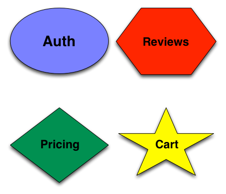
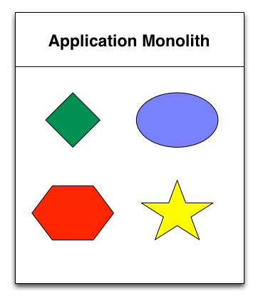
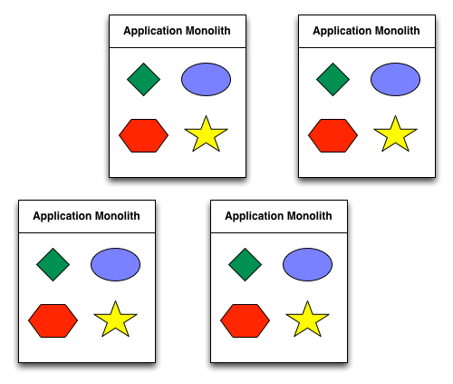
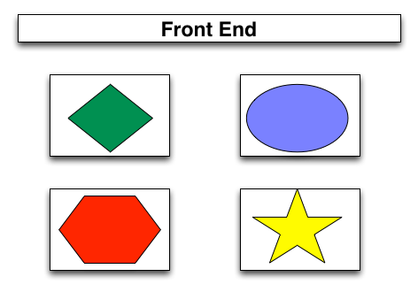
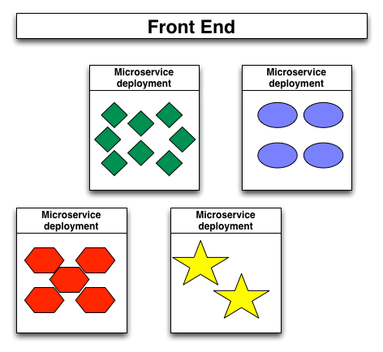
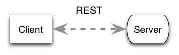
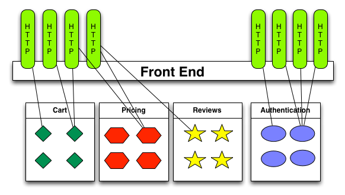
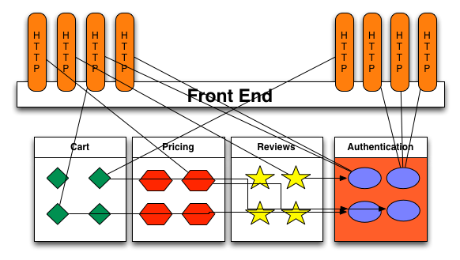
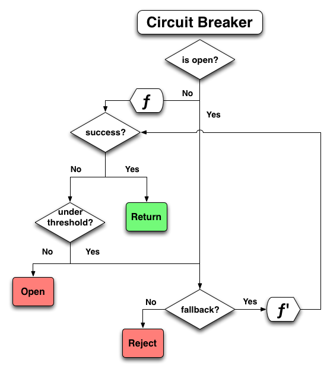
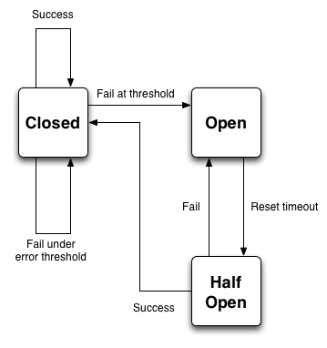

layout: true

{{content}}

.footer[
  
]

---
# Microservice Resiliency
## From Front to Back End


### QCon São Paulo, 2017

Lance Ball,
Senior Software Engineer,
Red Hat

---

class: center

## Who am I?

### Senior Software Engineer, Red Hat

--


--


--


---

## µ Service


> software applications as suites of independently deployable services

https://martinfowler.com/articles/microservices.html

--

## But what does this mean?!

---
class: center, middle
## What's in an application?

---

class: center

## Stuff



---
class: center

## Monolithic application



???
Each of the various services of the application all live within a
single process. This could be a Java EE application server, or just
a PHP application. The point is that all of the "stuff" in your application
is bundled together as a whole.

---
class: center

## Scaling a monolith



???
The entire application is replicated when scaling a monolith.

---
class: center

## Microservice application



---
class: center

## Scaled microservices



???
"Microservice deployment" here could mean a replicated Docker container
or a Kubernetes pod or an Heroku dyno that can be scaled up as demand
increases, independently of other services.

Remember, the key here is that each service can be scaled independently
of the others. Your pricing "reviews" service will never be as busy as
your pricing service. So, these two processes should not scale together.

---
class: center, middle

## Wait... isn't this the UX track?

---
class: center

## Service Lifecycle

--



--

* Client makes a request

--

* Server provides a response

--

* Often using HTTP transport

--

* Often with JSON data format

---
class: center

## In the Browser

--


--

* XMLHttpRequest

--

* JQuery

--

* AJAX

---
class: center

## Microservice Requests
### (simplified)



???

This is a simplified view.
In fact, if you want to actually visualize a µService app,
see the next slide.

---
class: center, middle

## Operational Complexity

---

class: center

## Microservices Visualized

<video width="398" height="378" autoplay loop>
  <source src="https://video.twimg.com/tweet_video/C7sOlUjVYAEzz0y.mp4" type="video/mp4">

https://twitter.com/ThePracticalDev/status/845285541528719360

???
OPERATIONAL COMPLEXITY

µ-services are not inherently simpler. The complexity is shifted
from code and design to systems and operations.

---

## Problems

--

* Timeouts

--

* Network saturation

--

* Transitive dependencies

--

* Programmer error

--

* Disk failure

???

If your application uses any kind of I/O

---

class: center

## Cascading failures



---

class: center

## Umm, wow


---

# How to deal with all this

--

* Limit single points of failure

--

* Shed load when possible

--

* Provide fallback behavior

--

* Optimize failure discovery

---

## Circuit Breaker
--

* Calls that could fail are wrapped

--

* Circuit opens at a failure threshold

--

* Further calls short circuit for a while

--

* Later, circuit tries again and trips immediately if there is failure

---
class: middle, center



---
class: middle, center



---

## Async operation that could fail

```js
// Use JQuery to get cart info
$.get('http://mystore.com/cart')
  .then((json) => {
    // update the UI with JSON data
  })
  .catch((e) => {
    // oops something went wrong
   console.error(e);
  })
```

--

### Shed load when possible

???
This is fine, but it ignores the fact that the server may
be continually failing, and has no mechanism builtin to
allow for throttling back.

Fallback behavior could be implemented in the catch
clause, but may end up duplicating implementation of
the success condition.

---

## Aside - Promsies

```js
// Use JQuery to get cart info
$.get('http://mystore.com/cart')
* .then((json) => {
    // update the UI with JSON data
  })
* .catch((e) => {
    // oops something went wrong
   console.error(e);
  })
```
---

## Circuit Breaker Example

```js
// Use JQuery's ajax wrapper and circuit breaker
// defaults for failure threshold, timing, etc.
const circuit = circuitBreaker($.get);

circuit.fire('http://nodejs.org/dist/index.json')
  .then((json) => {
    // update the UI with JSON data
  })
  // on failure, just log to console
  .catch(console.error);
```

???

Doesn't look that much different than the original.
But this version allows your code to automatically
throttle requests to allow the server to recover.

Note the promise API in use here. What about callbacks?
Node uses callbacks everywhere...

---

## Circuit Breaker Example

```js
// Use JQuery's ajax wrapper and circuit breaker
// defaults for failure threshold, timing, etc.
*const circuit = circuitBreaker($.get);

circuit.fire('http://nodejs.org/dist/index.json')
  .then((json) => {
    // update the UI with JSON data
  })
  // on failure, just log to console
  .catch(console.error);
```

---

## Circuit Breaker Example

```js
// Use JQuery's ajax wrapper and circuit breaker
// defaults for failure threshold, timing, etc.
const circuit = circuitBreaker($.get);

*circuit.fire('http://nodejs.org/dist/index.json')
  .then((json) => {
    // update the UI with JSON data
  })
  // on failure, just log to console
  .catch(console.error);
```

---

## Promises vs. Callbacks

```js
// Wrap Node.js' fs.readFile as a promise-returning function
*const readFile = circuitBreaker.promisify(fs.readFile);

const circuit = circuitBreaker(readFile, options);

circuit.fire('./package.json', 'utf-8')
  .then(console.log)
  .catch(console.error);
```

???

Switch to terminal and do this example.
Use the error output to point out the need for a fallback

---

## Circuit Breaker Fallback

### Provides default behavior in case of error

```js
circuit.fallback((file) => `Sorry, I can't read ${file}`);

// Fallback function is still a success case
circuit.fire('./package.jsob')
  .then((data) => console.log(`package.json: \n${data}`))
  .catch((err) => console.error(`ERR: ${err}`));
```

???
Go back to the console to demonstrate this. But DO NOT USE MULTILINE.

---

## Caching
### Always returns the same value

```js
const now = circuitBreaker(Date, { cache: true });
```

---

## When is this useful?

* Frequent hits, infrequent change
* E.g. temperature

```js
const temp = circuitBreaker(fetchTemperature, { cache: true });

// periodically clear the cache
setInterval(_ => temp.clearCache(), 3000);
```

---

## Events
---------------------------
|fallback |open |halfOpen |

Circuit breakers are event emitters

```js
  // Update the UI specifically for timeout errors
  circuit.on('timeout',
    () => $(element).prepend(
      makeNode(`TIMEOUT: ${route} is taking too long to respond.`)));
```

|fallback |open |halfOpen |

|`close` | `fire` | `reject` |
|`timeout` | `success` | `failure` |

---

## Status

Rolling statistical window

.pure-table.pure-table-bordered.pure-table-striped.smaller-font[
  |header1 | header 2|
  |--------|---------|
  | 1      | 2       |
  | 3      | 4       |
]


---

## Demo

---
class: center

## Finally

* Lance Ball
* http://lanceball.com
* Twitter - @lanceball
* GitHub - @lance

---

## Questions
